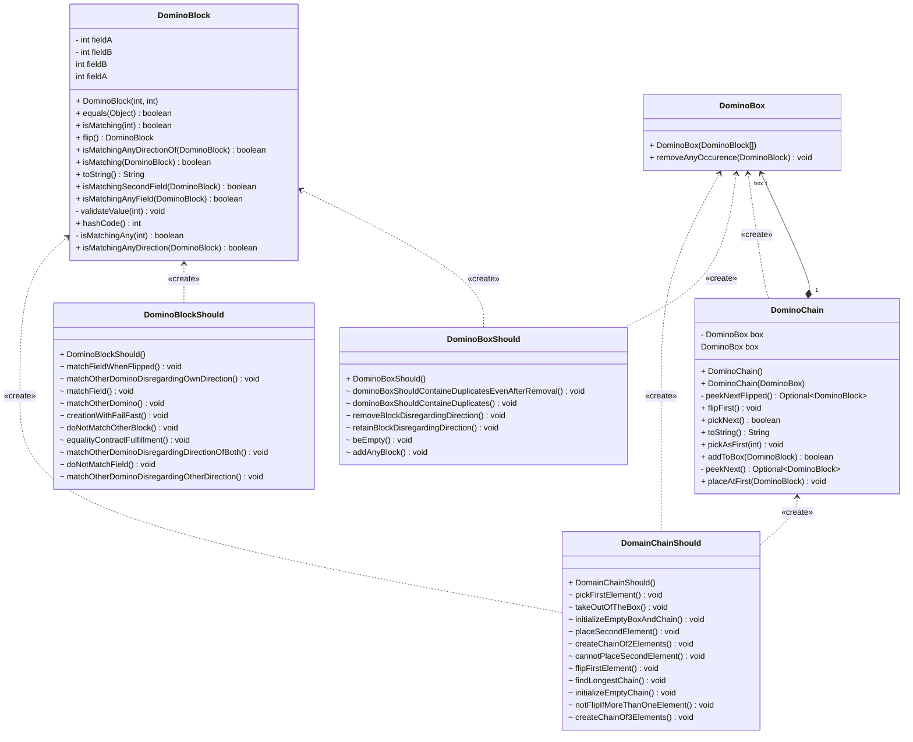

```mermaid
classDiagram
direction BT
class DomainChainShould {
  + DomainChainShould() 
  ~ pickFirstElement() void
  ~ takeOutOfTheBox() void
  ~ initializeEmptyBoxAndChain() void
  ~ placeSecondElement() void
  ~ createChainOf2Elements() void
  ~ cannotPlaceSecondElement() void
  ~ flipFirstElement() void
  ~ findLongestChain() void
  ~ initializeEmptyChain() void
  ~ notFlipIfMoreThanOneElement() void
  ~ createChainOf3Elements() void
}
class DominoBlock {
  + DominoBlock(int, int) 
  - int fieldA
  - int fieldB
  + equals(Object) boolean
  + isMatching(int) boolean
  + flip() DominoBlock
  + isMatchingAnyDirectionOf(DominoBlock) boolean
  + isMatching(DominoBlock) boolean
  + toString() String
  + isMatchingSecondField(DominoBlock) boolean
  + isMatchingAnyField(DominoBlock) boolean
  - validateValue(int) void
  + hashCode() int
  - isMatchingAny(int) boolean
  + isMatchingAnyDirection(DominoBlock) boolean
   int fieldB
   int fieldA
}
class DominoBlockShould {
  + DominoBlockShould() 
  ~ matchFieldWhenFlipped() void
  ~ matchOtherDominoDisregardingOwnDirection() void
  ~ matchField() void
  ~ matchOtherDomino() void
  ~ creationWithFailFast() void
  ~ doNotMatchOtherBlock() void
  ~ equalityContractFulfillment() void
  ~ matchOtherDominoDisregardingDirectionOfBoth() void
  ~ doNotMatchField() void
  ~ matchOtherDominoDisregardingOtherDirection() void
}
class DominoBox {
  + DominoBox(DominoBlock[]) 
  + removeAnyOccurence(DominoBlock) void
}
class DominoBoxShould {
  + DominoBoxShould() 
  ~ dominoBoxShouldContaineDuplicatesEvenAfterRemoval() void
  ~ dominoBoxShouldContaineDuplicates() void
  ~ removeBlockDisregardingDirection() void
  ~ retainBlockDisregardingDirection() void
  ~ beEmpty() void
  ~ addAnyBlock() void
}
class DominoChain {
  + DominoChain() 
  + DominoChain(DominoBox) 
  - DominoBox box
  - peekNextFlipped() Optional~DominoBlock~
  + flipFirst() void
  + pickNext() boolean
  + toString() String
  + pickAsFirst(int) void
  + addToBox(DominoBlock) boolean
  - peekNext() Optional~DominoBlock~
  + placeAtFirst(DominoBlock) void
   DominoBox box
}

DomainChainShould  ..>  DominoBlock : «create»
DomainChainShould  ..>  DominoBox : «create»
DomainChainShould  ..>  DominoChain : «create»
DominoBlockShould  ..>  DominoBlock : «create»
DominoBoxShould  ..>  DominoBlock : «create»
DominoBoxShould  ..>  DominoBox : «create»
DominoChain  ..>  DominoBox : «create»
DominoChain "1" *--> "box 1" DominoBox 
```