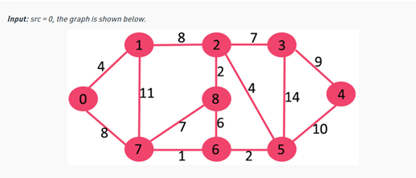
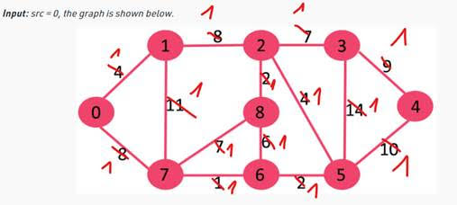

Following up on our phone conversation, I am sharing some sample tasks that may appear on the CoderPad, along with a link to the CoderPad Demo: https://coderpad.io/demo/. This demo can be used to practice the skills that will be assessed.

1. [Domino / sequence of numbers](https://stackoverflow.com/questions/26189818/longest-domino-chain-sequence)

[Solution](./../../../../app/src/main/java/com/koolo90/tasks/recruitment/sii/domino/DominoTable.java)

[Test](./../../../../app/src/test/java/com/koolo90/tasks/recruitment/sii/domino/DominoChainShould.java)

[Diagram(Mermaid)](./../../../../app/src/test/resources/com/koolo90/tasks/recruitment/sii/domino/DomainChainShould.md)

2. [Calculating snow trapped in mountain crevices](https://www.csestack.org/snow-between-hills-coding-challenge/)
   [Solution](../url/to/a/implementation/class.java)

   [Calculating water trapped in rocks](https://www.geeksforgeeks.org/trapping-rain-water/)
   [WIP Solution](../url/to/a/implementation/class.java)

3. [Median in the set of numbers](https://www.geeksforgeeks.org/median/)
   [Solution](./../../../../app/src/main/java/com/koolo90/tasks/recruitment/sii/median/set/MedianShould.java)

4. [Find the median of the combination of two arrays](https://www.geeksforgeeks.org/median-of-two-sorted-arrays-of-different-sizes/)
   [Solution](./../../../../app/src/main/java/com/koolo90/tasks/recruitment/sii/median/array/MedianShould.java)

5. [Hash Map implementation](https://www.geeksforgeeks.org/hashing-set-2-separate-chaining/) L8R
   [Solution](../url/to/a/implementation/class.java)

7. [Hash Map implementation](https://www.geeksforgeeks.org/implementing-our-own-hash-table-with-separate-chaining-in-java/)
   [Solution](../url/to/a/implementation/class.java)

6. [Reverse the string (algorithm, not using reverse method)](https://www.geeksforgeeks.org/reverse-a-string-in-java/)
   [Solution](./../../../../app/src/main/java/com/koolo90/tasks/recruitment/sii/reverse/StringReverseShould.java)

7. [Finding numbers in the array](https://www.geeksforgeeks.org/binary-search/)
   [Solution](../url/to/a/implementation/class.java)
   
8. [Any search algorithm (advantages and disadvantages)](https://www.geeksforgeeks.org/searching-algorithms/)
   [Solution](../url/to/a/implementation/class.java)

8. Find the number of pairs which values add up to the specified value
   [Pair of numbers that sums up to (easy)](https://www.geeksforgeeks.org/given-an-array-a-and-a-number-x-check-for-pair-in-a-with-sum-as-x/)
   [Solution](../url/to/a/implementation/class.java)
   [Pair of numbers that sums up to (medium)](https://www.geeksforgeeks.org/count-pairs-with-given-sum/)
   [Solution](../url/to/a/implementation/class.java)

9. [There is a list of strings: task is to create a set of sets, with the same anagram](https://www.geeksforgeeks.org/given-a-sequence-of-words-print-all-anagrams-together/) 
   (‘dog’ i ‘God’ would be the same, as alphabetically sorted anagram is ‘dgo’)

10. [Finding the shortest route from point A to point B](https://www.geeksforgeeks.org/shortest-path-unweighted-graph/)
(How to write a program that goes from point A to B through the smallest number of vertices)
Dijkstra, Minimum spanning tree, Maximum flow, Prim’s, Kruskal, Bellman-Ford, DFS, BFS
[Dijkstras shortest path algorithm](https://www.geeksforgeeks.org/dijkstras-shortest-path-algorithm-greedy-algo-7/)
(The smallest number of cities, treating the weight of each road as 1)
The largest number of cities/vertices along the way:

Output: 0 4 12 19 21 11 9 8 14

Explanation: The distance from 0 to 1 = 4.

The minimum distance from 0 to 2 = 12. 0->1->2

The minimum distance from 0 to 3 = 19. 0->1->2->3

The minimum distance from 0 to 4 = 21. 0->7->6->5->4

The minimum distance from 0 to 5 = 11. 0->7->6->5

The minimum distance from 0 to 6 = 9. 0->7->6

The minimum distance from 0 to 7 = 8. 0->7

The minimum distance from 0 to 8 = 14. 0->1->2->8

The smallest number of cities/vertices along the way:

11. Finding the second largest value in the table
Hint: Implemented solution should be linear. Traverse the entire list once to find, for example, the largest element or the second smallest (lower computational complexity)
https://www.geeksforgeeks.org/find-second-largest-element-array/

12. Search for the most frequently occurring IP address in http server logs
A function that searches for the most frequently occurring IP plus write tests plus questions like: which IP will be returned, if two occurred the same often
https://www.geeksforgeeks.org/parsing-apache-access-log-in-java/
(taking into account the situation where addresses do not appear)

13. Find the first non-repeating character in the words "test" and "aabbdc". Solution: "e" in the first case, "d" in the second case.
    Note: This refers to the first non-repeating character in the word itself, not the first in alphabetical order.
https://www.geeksforgeeks.org/first-non-repeating-character-using-one-traversal-of-string-set-2/

14. Given an alphabet as a string, find all characters from the alphabet that do not appear in a given sentence and return them sorted alphabetically – see attached solution (code included in 14. Pangram detector).

15. Average grades – also see the attached solution from a colleague (15. Average grades.java).
    There is a two-dimensional array of students with their grades. Student names may repeat.
    The task is to find the highest average – there are different variations of the problem, e.g., a 
    grade of n (infinity) and/or a student with only one grade.

* given input array of students with grades like so:

* String[][] scores = {{"Bob","85"},{"Mark","100"},{"Charles","63"},{"Mark","34"}};

* calculate best average grade. If the average is decimal floor it down to the nearest integer value.

* Grades can be positive and negative integer values.

* Write down some edge cases test

*/

Kilka osób miało to (lub bardzo podobne) zadanie, uwaga od innych:

- „Na potrzeby testów (dostarczonych w ramach zadania) ma 
- znaczenie precyzja - wystarczy int, ale nie można liczyć 
- średniej na bieżąco”

Scope: Finding the best mean in the table + Average, 
highest mean for each student + Grouping, sorting, max (lambda)

16. Queries to check if a number lies in N ranges of L-R
https://www.geeksforgeeks.org/queries-to-check-if-a-number-lies-in-n-ranges-of-l-r/

17. For a given value, find the shortest possible word 
    (in terms of number of letters).
    Each letter of the alphabet is assigned a number as follows:
A=1
B=2*A+2=4
C=3*B+3=15
D=4*C+4=64
...

The value of a word formed from letters is equal to the sum of the values of 
its letters, for example:
AAD = 1 + 1 + 64 = 66

Task: For a given word value, find the shortest possible word 
(in terms of number of letters).
For example, if the word value is 25, possible words could be:

AAAAAAAAAAAAAAAAAAAAAAAAA (25 letters “A”)
BBBBAAAAAAAAA
…but the shortest word would be:
CBBAA

18. The method should return the number of trailing zeros in a number.
    For example:
For 100 → 2 trailing zeros
For 5! (which is 120) → 1 trailing zero
Note: Factorials might be misleading; the task is simply to count and return the number of 
19. zeros at the end of the number.
https://www.geeksforgeeks.org/count-trailing-zeroes-factorial-number/

19. Move all zeros to the end of the array

np. int[] arr = {‘0’, ‘1’,’7’,’0’, ’6’,’9, ‘0’,’6’,’9};
https://www.geeksforgeeks.org/move-zeroes-end-array/

20. Problem: Find the smallest distance between two words in a text.
    Example: Find the shortest distance between the words “łąką” and “woda”. These words may appear multiple times in the text, and you need to find the occurrences that are closest to each other.

The algorithm had already been written and the program was running, but it returned incorrect results.
The task was to find the bug or add the necessary code.

https://www.geeksforgeeks.org/minimum-distance-between-words-of-a-string/

21. Find the longest substring consisting of the same letter in a long word (consecutive letters in a block).
    Example: In abcabcabcadddddabcabcba, we need to find the sequence of d.
Also: Return the maximum occurring character in an input string.

[Matrix – index – longest sequence]

https://www.geeksforgeeks.org/return-maximum-occurring-character-in-the-input-string/

22. Longest String Overlapping
abcabc i bcedf => abcaedf

https://stackoverflow.com/questions/55587041/looping-through-string-array-find-the-two-strings-with-the-most-overlap-and-mer

23. Find alphabet in a Matrix which has maximum number of stars around it
https://www.geeksforgeeks.org/find-alphabet-in-a-matrix-which-has-maximum-number-of-stars-around-it/

24. Calculation of the volume of liquid that a container can hold
https://www.geeksforgeeks.org/java-program-to-find-the-volume-and-surface-area-of-cuboid/
https://www.geeksforgeeks.org/find-water-in-a-glass/

25. BST (Binary Search Tree)

26. aabbb -> 2a3b

Areas that are assessed on CoderPad:

| Competency         | Rating (1-3) |
|--------------------|--------------|
| Problem Solving    |              |
| Reading Code       | 1            |
| Writing Code       | 1            |
| Quality Evaluation | 1            |
| Communication      | 1            |
| Total Score        | 15           |